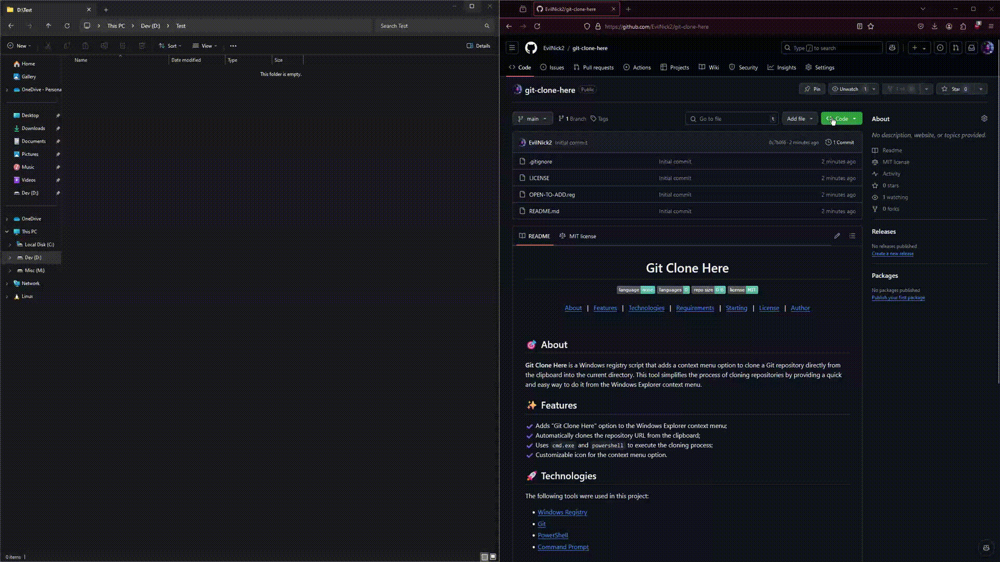

 
  

  &#xa0;

<h1 align="center">Git Utilities</h1>

  
  
  
  

  <a href="#dart-about">About</a> &#xa0; | &#xa0; 
  <a href="#sparkles-features">Features</a> &#xa0; | &#xa0;
  <a href="#rocket-technologies">Technologies</a> &#xa0; | &#xa0;
  <a href="#white_check_mark-requirements">Requirements</a> &#xa0; | &#xa0;
  <a href="#checkered_flag-using">Using</a> &#xa0; | &#xa0;
  <a href="#memo-license">License</a> &#xa0; | &#xa0;
  <a href="https://github.com/EvilNick2" target="_blank">Author</a>

 

## :dart: About ##

**Git Utilities** is a set of Windows registry scripts that add a new submenu to the Windows Explorer context menu. This submenu houses two options:
- **Git Clone Here:** Clones a Git repository from the clipboard directly into the current directory.
- **Git Pull Here:** Performs a Git pull in the current directory.

These tools simplify Git operations directly from the Windows Explorer context menu.

## :sparkles: Features ##

:heavy_check_mark: Adds a "Git Utilities" submenu to the Windows Explorer context menu  
:heavy_check_mark: Houses "Git Clone Here" and "Git Pull Here" within this submenu  
:heavy_check_mark: Automatically clones the repository URL from the clipboard  
:heavy_check_mark: Executes Git pull to update repositories  
:heavy_check_mark: Uses `cmd.exe` and `powershell` to perform operations  
:heavy_check_mark: Customizable icons for the context menu options

## :rocket: Technologies ##

The following tools were used in this project:

- [Windows Registry](https://docs.microsoft.com/en-us/windows/win32/sysinfo/registry)
- [Git](https://git-scm.com/)
- [PowerShell](https://docs.microsoft.com/en-us/powershell/)
- [Command Prompt](https://docs.microsoft.com/en-us/windows-server/administration/windows-commands/windows-commands)

## :white_check_mark: Requirements ##

Before starting :checkered_flag:, you need to have [Git](https://git-scm.com) installed.

## :checkered_flag: Using ##

1. **Setup the Submenu:**
   - Open the [`git-utilities.reg`](./git-utilities.reg) file and double-click to add the entries to your registry.
   
2. **Using the Options:**
   - **Git Clone Here:** Copy the desired repository URL to your clipboard. Right-click in your desired folder background, select **Git Utilities**, and then click **Git Clone Here**.
   - **Git Pull Here:** Right-click within an existing Git repository folder, select **Git Utilities**, and then click **Git Pull Here** to perform an update.

## :memo: License ##

This project is under the MIT license. For more details, see the [LICENSE](./LICENSE) file.

Made with :heart: by [EvilNick2](https://github.com/EvilNick2)

&#xa0;

<a href="#top">Back to top</a>